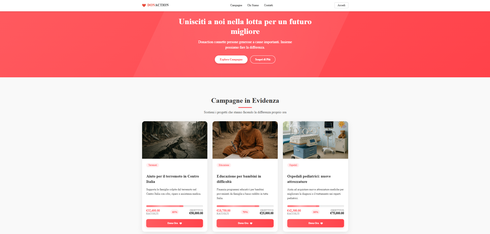
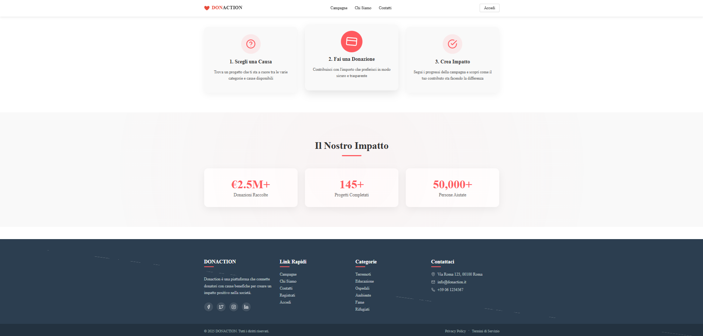

# DONACTION

A full-stack web platform for managing donation campaigns with a comprehensive user, team, and admin role system. DONACTION enables users to create, discover, and contribute to charitable campaigns through a modern, secure, and scalable architecture.




## Table of Contents

- [Overview](#overview)
- [Architecture](#architecture)
- [Tech Stack](#tech-stack)
- [Features](#features)
- [Project Structure](#project-structure)
- [Getting Started](#getting-started)
- [API Documentation](#api-documentation)
- [Security](#security)
- [License](#license)

## Overview

DONACTION is a donation platform that connects donors with meaningful causes. The application provides:

- **Public Campaign Discovery**: Browse and search active donation campaigns
- **User Management**: Role-based access control (Admin, Team, Registered Users)
- **Campaign Creation**: Authorized users can create and manage fundraising campaigns
- **Secure Donations**: Process donations with tracking and reporting capabilities
- **Admin Dashboard**: Comprehensive administration tools for platform management

## 🏗 Architecture

DONACTION follows a modern **client-server architecture** with a clear separation between frontend and backend:

```
┌─────────────────────┐
│   Angular Frontend  │  ← Client-side SPA with SSR support
│   (Port 4200)       │
└──────────┬──────────┘
           │ HTTP/REST API
           ↓
┌─────────────────────┐
│   Express Backend   │  ← RESTful API Server
│   (Port 8080)       │
└──────────┬──────────┘
           │ SQL Queries
           ↓
┌─────────────────────┐
│   MySQL Database    │  ← Data Persistence Layer
└─────────────────────┘
```

### Backend Architecture

The backend follows the **MVC (Model-View-Controller)** pattern with the following layers:

- **Routes**: Define API endpoints and HTTP methods
- **Middleware**: Handle authentication, authorization, and request validation
- **Controllers**: Implement business logic and orchestrate data flow
- **Models**: Manage database operations and data access
- **Config**: Handle environment configuration and database connections

### Frontend Architecture

The frontend is built using **Angular 19** with:

- **Component-based architecture**: Modular and reusable UI components
- **Service layer**: Handle HTTP communication and state management
- **Guards**: Protect routes based on authentication and authorization
- **Interceptors**: Manage authentication tokens and HTTP request/response handling
- **Reactive programming**: RxJS for asynchronous data streams

## Tech Stack

### Frontend

- **Framework**: Angular 19.2
- **Language**: TypeScript 5.7
- **Rendering**: Server-Side Rendering (SSR) with Angular Universal
- **HTTP Client**: Angular HttpClient with RxJS
- **Routing**: Angular Router with route guards
- **Styling**: CSS3
- **Build Tool**: Angular CLI

### Backend

- **Runtime**: Node.js
- **Framework**: Express.js 5.1
- **Language**: JavaScript (ES6+)
- **Database**: MySQL 2
- **Authentication**: JWT (jsonwebtoken)
- **Password Hashing**: bcrypt
- **Email**: Nodemailer
- **CORS**: Enabled for cross-origin requests
- **Environment**: dotenv for configuration management

### Development Tools

- **Nodemon**: Auto-restart during development
- **Angular DevKit**: Build optimization and development server

## Features

### For Users

- **Authentication & Authorization**

  - User registration and login
  - Password reset via email
  - JWT-based session management
  - Role-based access control

- **Campaign Management**

  - Browse active campaigns
  - View detailed campaign information
  - Search and filter campaigns
  - Track campaign progress and donations

- **Donation System**
  - Secure donation processing
  - Donation history tracking
  - User dashboard with contribution overview
  - Anonymous donation option

### For Admins & Team

- **Admin Dashboard**

  - Comprehensive platform overview
  - User management (create, update, delete users)
  - Campaign moderation and management
  - Donation tracking and reporting
  - Access code generation for team members

- **Campaign Administration**
  - Create and edit campaigns
  - Set fundraising goals and deadlines
  - Monitor campaign performance
  - Approve or reject campaigns

### Security Features

- **Authentication**: JWT tokens with secure storage
- **Authorization**: Role-based middleware protection
- **Password Security**: bcrypt hashing with salt
- **Data Validation**: Input sanitization and validation
- **CORS Protection**: Configured origin restrictions
- **Password Recovery**: Secure token-based reset flow

## Project Structure

### Backend Structure

```
backend/
├── config/
│   └── db.js                    # Database connection pool
├── controllers/
│   ├── admin.controller.js      # Admin operations
│   ├── auth.controller.js       # Authentication logic
│   ├── campaign.controller.js   # Campaign CRUD operations
│   ├── donation.controller.js   # Donation processing
│   └── user.controller.js       # User management
├── middleware/
│   └── auth.middleware.js       # JWT verification & role checks
├── models/
│   ├── campaign.model.js        # Campaign data access
│   ├── donation.model.js        # Donation data access
│   ├── user.model.js            # User data access
│   └── password-reset.model.js  # Password reset tokens
├── routes/
│   ├── admin.routes.js          # Admin endpoints
│   ├── auth.routes.js           # Auth endpoints
│   ├── campaign.routes.js       # Campaign endpoints
│   ├── donation.routes.js       # Donation endpoints
│   └── user.routes.js           # User endpoints
├── seed/
│   └── seed.js                  # Database seeding
└── server.js                    # Express app entry point
```

### Frontend Structure

```
frontend/src/
├── app/
│   ├── components/              # UI components
│   │   ├── home/                # Landing page
│   │   ├── campaign-list/       # Campaign browser
│   │   ├── campaign-detail/     # Campaign details
│   │   ├── donation-form/       # Donation interface
│   │   ├── login/               # User login
│   │   ├── register/            # User registration
│   │   ├── profile/             # User profile
│   │   ├── user-dashboard/      # User donation history
│   │   ├── admin-dashboard/     # Admin overview
│   │   ├── admin-login/         # Admin authentication
│   │   └── admin/               # Admin management panels
│   │       ├── admin-campaigns/ # Campaign management
│   │       ├── admin-users/     # User management
│   │       └── admin-donations/ # Donation oversight
│   ├── guards/
│   │   ├── auth.guard.ts        # Authentication protection
│   │   └── admin.guard.ts       # Admin authorization
│   ├── interceptors/
│   │   └── auth.interceptor.ts  # JWT token injection
│   ├── models/
│   │   ├── campaign.model.ts    # Campaign interfaces
│   │   └── donation.model.ts    # Donation interfaces
│   ├── services/
│   │   ├── auth.service.ts      # Authentication service
│   │   ├── campaign.service.ts  # Campaign API calls
│   │   ├── donation.service.ts  # Donation API calls
│   │   ├── user.service.ts      # User API calls
│   │   └── admin.service.ts     # Admin API calls
│   └── app.routes.ts            # Application routing
└── assets/                      # Static resources
```

## Getting Started

### Prerequisites

- **Node.js**: v18.19.1 or higher (v20.11.1+ or v22+ recommended)
  - **Required for both frontend and backend**
  - Angular 19 requires Node.js >= 18.19.1
  - Express 5.1.0 and bcrypt 6.0.0 require Node.js >= 18
  - Check your version: `node --version`
  - Download from: [nodejs.org](https://nodejs.org/)
- **MySQL**: v8.0 or higher
- **npm**: v8.0.0 or higher (comes with Node.js)

> **⚠️ Important**: If you're using Node.js v16 or lower, you will encounter `EBADENGINE` warnings and potential runtime issues. Please upgrade to Node.js v18+ before proceeding with the installation.

### Installation

1. **Clone the repository**

   ```bash
   git clone <repository-url>
   cd DONACTION
   ```

2. **Backend Setup**

   ```bash
   cd backend
   npm install
   ```

   Edit the `.env` file in the backend directory:

   ```env
   PORT=8080
   DB_HOST=localhost
   DB_USER=your_db_user
   DB_PASSWORD=your_db_password
   DB_NAME=donaction_db
   JWT_SECRET=your_jwt_secret_key
   EMAIL_USER=your_email@example.com
   EMAIL_PASS=your_email_password
   ```

   Initialize the database:

   ```bash
   # Run the seed script to create tables and initial data
   node seed/seed.js
   ```

3. **Frontend Setup**

   ```bash
   cd frontend
   npm install
   ```

   Update the API endpoint in environment configuration if needed.

### Running the Application

1. **Start the Backend Server**

   ```bash
   cd backend
   npm start          # Production mode
   npm run dev        # Development mode with nodemon
   ```

   The API will be available at `http://localhost:8080`

2. **Start the Frontend Application**

   ```bash
   cd frontend
   npm start          # Development server
   ```

   The application will be available at `http://localhost:4200`

3. **Build for Production**

   ```bash
   # Frontend build
   cd frontend
   npm run build

   # For SSR
   npm run serve:ssr:frontend
   ```

## API Documentation

### Base URL

```
http://localhost:8080/api
```

### Authentication Endpoints

- `POST /auth/register` - Register a new user
- `POST /auth/login` - User login
- `POST /auth/forgot-password` - Request password reset
- `POST /auth/reset-password` - Reset password with token

### Campaign Endpoints

- `GET /campaigns` - Get all campaigns
- `GET /campaigns/:id` - Get campaign by ID
- `POST /campaigns` - Create campaign (Admin/Team)
- `PUT /campaigns/:id` - Update campaign (Admin/Team)
- `DELETE /campaigns/:id` - Delete campaign (Admin)

### Donation Endpoints

- `GET /donations` - Get all donations (Admin)
- `POST /donations` - Create donation
- `GET /donations/user/:userId` - Get user donations
- `GET /donations/campaign/:campaignId` - Get campaign donations

### User Endpoints

- `GET /users/profile` - Get current user profile
- `PUT /users/profile` - Update user profile
- `GET /users/:id/donations` - Get user donation history

### Admin Endpoints

- `GET /admin/users` - Get all users
- `POST /admin/users` - Create user
- `PUT /admin/users/:id` - Update user
- `DELETE /admin/users/:id` - Delete user
- `GET /admin/codes` - Get available access codes
- `POST /admin/generate-code` - Generate team access code

## Security

### Authentication Flow

1. User registers or logs in via `/api/auth/login`
2. Backend validates credentials and returns JWT token
3. Frontend stores token in localStorage/sessionStorage
4. Auth interceptor attaches token to subsequent requests
5. Backend middleware verifies token and extracts user info
6. Route guards protect frontend routes based on user roles

### Role Hierarchy

- **Admin**: Full platform access and management
- **Team**: Campaign creation and management
- **Registered**: View campaigns and make donations
- **Public**: View campaigns only (no account required)

### Protected Routes

Backend routes are protected using the `auth.middleware.js` which:

- Verifies JWT token validity
- Checks user role permissions
- Returns 401 for unauthorized requests
- Returns 403 for insufficient permissions

## 📝 License

This project is private and proprietary. All rights reserved.

---

**Built with ❤️ for making a difference through technology**.
